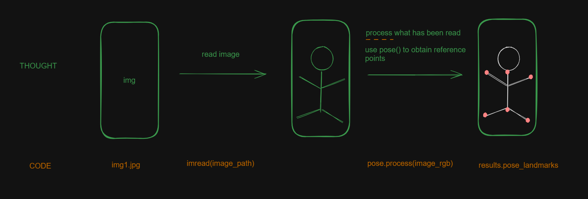

# 10 Body Pose Detection

## Goal
Evaluate the performance of computer vision models. 

## Tech Stack

+ Python
+ OpenCV
+ MediaPipe - Pose()
+ OpenPose

## Process

I want to detect body pose in 10 images representing different movements in different contexts.

For do this I will use the OpenPose and MediaPipe algorithms.

Then I compare the algorithms I decided to use in OpenPose and MediaPipe to analize the accurance, precision and processing time for each image.
